# Proposal: closing the affordance gap with silvia

**Status: partly built.** Part 1 is the inventory of what silvia offers a pair of hands, and
Part 1b audits its library, read out of the live registry; both are reference and stay. Part
2 is what supersilvia has of it. Part 3 is what is left to build, as fundamentals rather than
features — each a small piece of state or dispatch that pays for a dozen affordances at once.
When one is agreed, its decisions move to `docs/decisions.md` as *Agreed, not built*; when it
is built, the behavior moves to `docs/ui.md`, `docs/nodes.md` and `docs/design-system.md`,
and its section here goes.

Written after driving silvia 0.8-web end to end — every menu, every panel, every control
gesture — and reading `js/snumber.js`, `js/scolor.js`, `js/snode.js`, `js/menu.js`,
`js/mainInput*.js`, `js/mainMixer*.js`, `js/howto.js` and the 144 node files against
`src/ui/`, `src/nodes/` and `src/app/`.

---

## Part 1 — What silvia offers

Screenshots are in [affordances/](affordances/), captured from silvia 0.8-web at 1920x937.

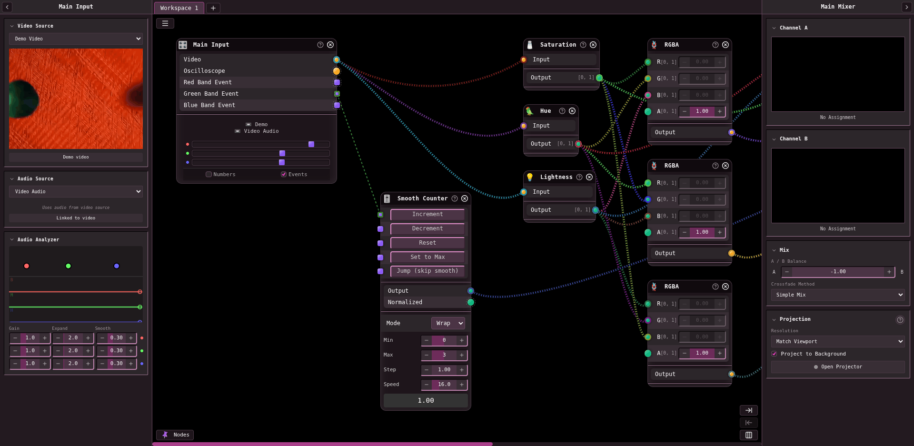

*The default patch. Main Input panel left; workspace tab bar, hamburger and the `Nodes`
button around the canvas; Main Mixer right.*

### Global keys

| | |
| --- | --- |
| `` ` `` | Quick Menu at the cursor (fuzzy search every node) |
| `N` | Nodes Menu (browse by category) |
| `H` | Hide the editor — nodes and cables vanish, the output fills the window, a toast says how to come back |
| `F` | Fullscreen |
| `P` | Drop a dragged node in place |
| `Escape` | Cancel a drag, close a modal, unfocus a field |
| right-click | Quick Menu at the cursor |
| wheel | scroll the workspace |
| `Ctrl+T` / `Ctrl+1‑9` | new workspace / jump to workspace |
| `Ctrl+S` / `Ctrl+Shift+S` | quick save (overwrites) / Save As |

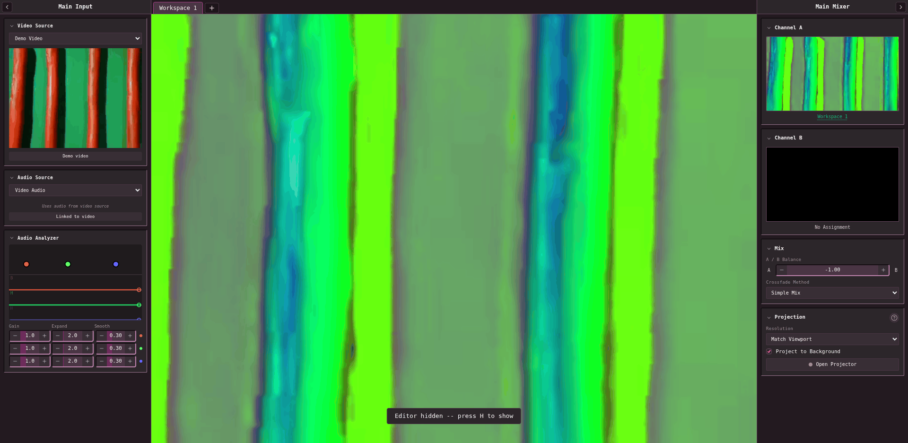

*`H`. The nodes and cables are gone; the toast is the only chrome left over the output.*

### The three node menus

They are three renderings of one list, and that is the point.

1. **Nodes Menu** — a floating `Nodes` button bottom-left, or `N`. Fifteen categories with
   emoji icons; hover opens a submenu. Each entry is *icon · label · port signature*, the
   signature drawn as colored dots — inputs, a divider, outputs. You can read a node's type
   before you place it.
2. **Quick Menu** — `` ` `` or right-click, opening at the cursor. A text field over a
   filtered list; fuzzy, so `blur` finds Blur, Motion Blur, Radial Blur *and* Region
   (Absolute). Same rows, same signature dots. Arrows navigate, `Enter` creates at the
   cursor.
3. **Node context menu** — right-click a node header: Collapse/Expand, Delete Connections,
   Duplicate, Reset Controls, Clear MIDI Mappings, Delete; then, when more than one workspace
   exists, a checkbox per workspace controlling which tabs show this node.

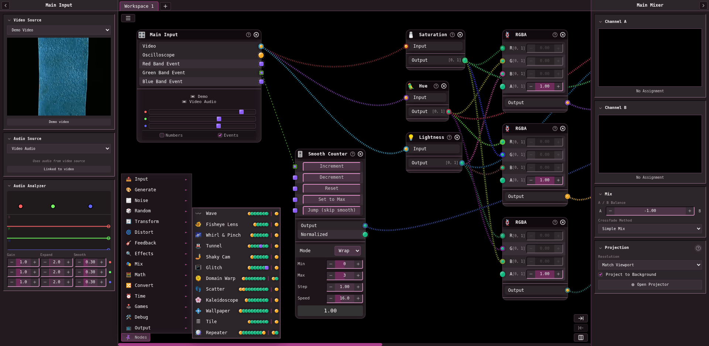

*Nodes Menu. Fifteen categories; each entry is icon, label, and the port signature as
colored dots — inputs, divider, outputs.*

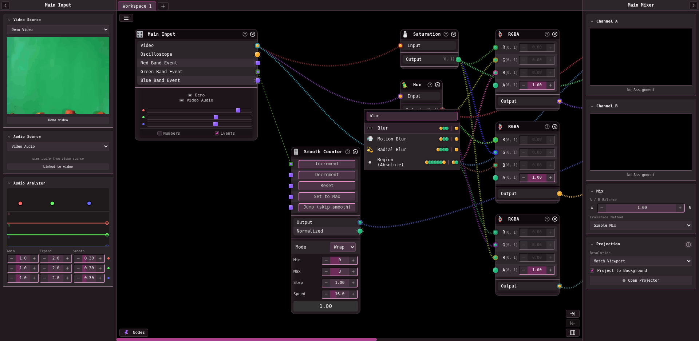

*Quick Menu at the cursor. `blur` fuzzy-matches Blur, Motion Blur, Radial Blur and Region
(Absolute).*

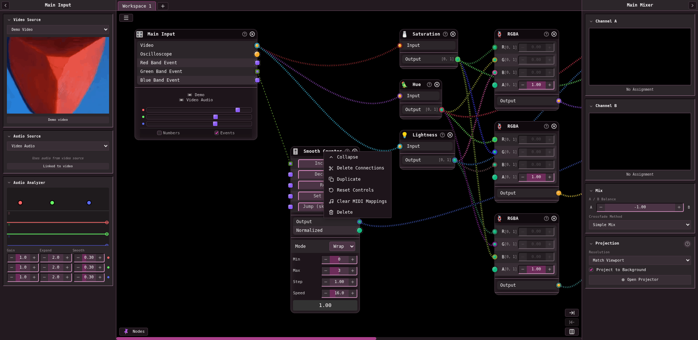

*Node context menu.*

### `s-number` — the number control

100x25, a `−` stepper, a value, a `+` stepper, and a **value-proportional fill behind the
text**. Every one of these gestures:

| gesture | effect |
| --- | --- |
| click + drag on the value | scrub. `Shift` = 0.1x fine. The anchor **resets when Shift changes**, so fine mode does not jump |
| drag on the track (not the value) | jump straight to that position in the range |
| wheel while focused | ±10 steps. `Shift` 0.1x, `Ctrl` 10x. Log controls multiply by 1.1 / 1.01 / 2 instead |
| click the value | focus and edit as text; `Enter` or blur commits, clamped |
| right-click the value | focus and select-all |
| `↑` / `↓` | one step |
| `[` / `]` | jump to min / max |
| `D` | reset to default |
| `R` | full reset — value, **min, max and step** |
| `Ctrl` + hover | reveal three editable fields under the control: min, step, max. Click any to type a new one |
| `Alt` + click | MIDI learn; `Alt` + click again unmaps. A mapped control wears a colored dot |
| `+` / `−` buttons | one step; `Ctrl` + click changes the *step size* by 10x / 0.1x |
| `Escape` mid-drag | restore the value the drag started from |

The control carries `value, default, min, max, step, unit, log-scale, disabled,
midi-disabled` — and `min/max/step` are **per instance, not per node type**. That is the
whole reason `R` is different from `D`.

A connected input shows the word `wired` in place of its control, grayed.

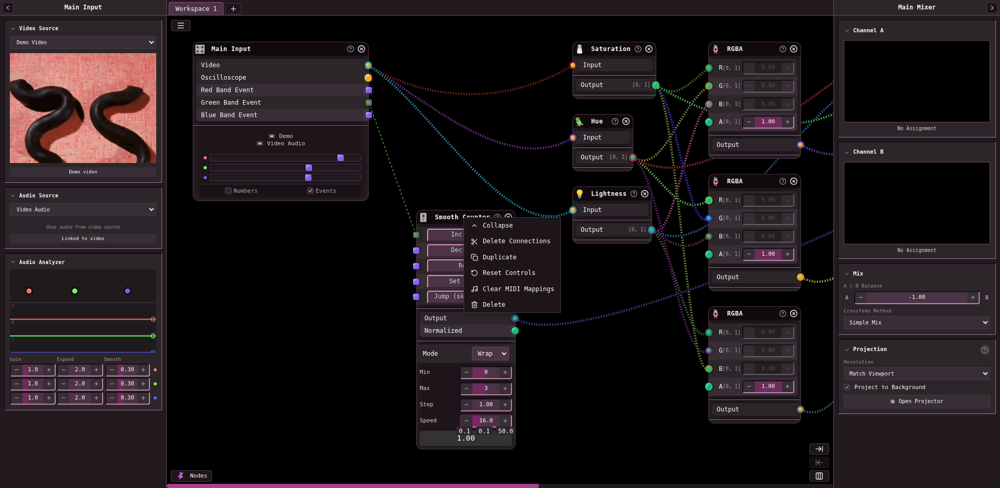

*`Ctrl` + hover on **Speed**: `0.1  0.1  50.0` appears under the control — min, step, max,
each editable by clicking it.*

### `s-color` — the color control

A swatch over a checkerboard, so alpha reads. Click opens a popup with four sliders — Hue,
Saturation, Lightness, Alpha — each painted with a **live gradient of what moving it would
do** (the hue bar is tinted by the current S and L; the saturation bar runs at the current
hue and lightness; alpha runs over a checkerboard), plus a `#rrggbbaa` text field. HSLA is
the source of truth, so hue survives a trip through black or white. `Escape` or a click
outside closes it. `noalpha` hides the alpha row.

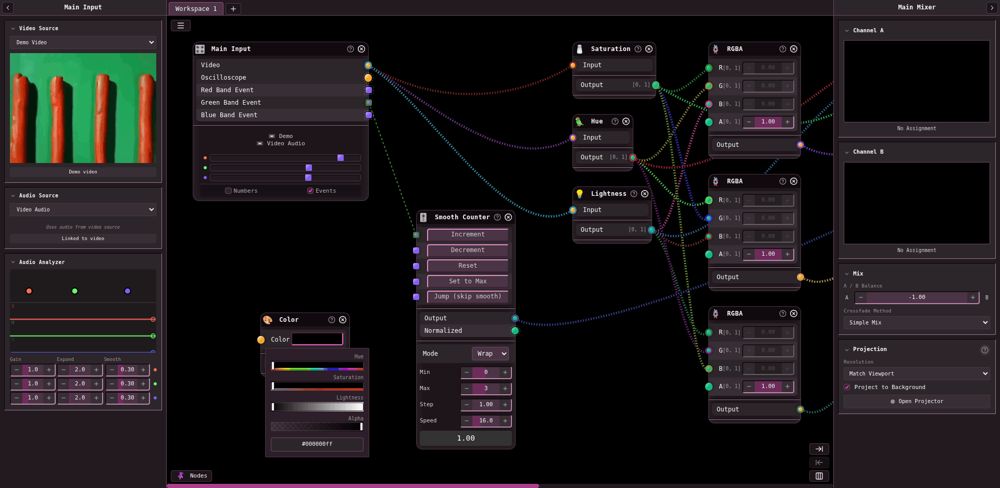

*Each slider is painted with the result of moving it.*

### Ports, cables, nodes

- Outputs right, inputs left; drag between them. Illegal targets are simply not offerable.
- Right-click a port disconnects it. Release on empty cancels. `Escape` cancels.
- Wires: phi-spaced colors or port-typed colors, striped coil-cable effect, droop, port
  border colors, hover glow with an adjustable glow radius — **all six are user settings**.
- A node header is the drag handle; it carries an emoji icon, the label, a `?` tooltip and an
  `x` close.

### The Output node

One `Input`, and then four **action inputs that are also buttons** — `Show on A`,
`Show on B`, `Snap`, `Rec` — each with its own event port on the left, so a sequencer can
fire them. Then a `Frame Out` color port on the right, a Resolution select (7 presets),
a Record Duration select, a **Frame History** number (1–120 frames of GPU ring buffer), a
live `VRAM: 36 MB` readout, a status line (`● Input   ● On A   ○ Rec Ready`), and the node's
own render, flush to the bottom corners.

`Frame Out` is what makes chained outputs, cross-output feedback rings, and
rasterize-before-blur all one mechanism.

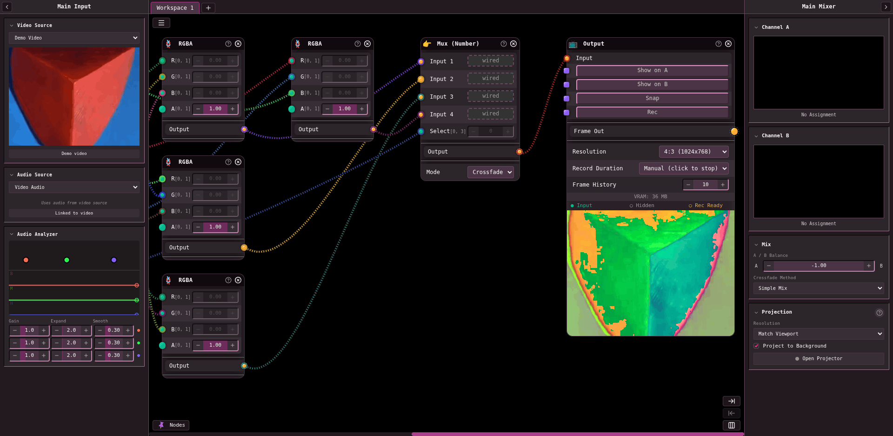

*Note the `wired` placeholders on the Mux node's connected inputs, left of the Output.*

### Offline Output, and why it matters more than it looks

A second terminal node that renders a **PNG sequence** at any resolution and fps, with
supersampling at 1x, 2x or 4x. It is not a convenience wrapper around the live renderer — it
inverts the direction time flows, and that is the interesting part.

Nodes opt in by defining `_prepareForTime(virtualTime, fps)`. The renderer collects those
**in topological order, sources first**, and steps each one to a virtual time before drawing
the frame. The whole CPU half stops being a function of the wall clock and becomes a function
of `t`, so a render is repeatable and frame-exact.

Feedback then raises a question a live renderer never has to answer — *what was on screen
before frame zero* — and it is answered with three **warm-up modes**:

| | |
| --- | --- |
| Black | clear the buffers, do not advance any time-driven state |
| Hold First Frame | render the scene at `t = 0` repeatedly |
| Run Sequence | run warm-up frames at **negative virtual time**, `(i − warmup)/fps` |

*Run Sequence* is the one that matters: a Geiss Flow or a feedback ring needs to reach its
steady state before the first frame anybody keeps, and the honest way to do that is to run
the patch backwards from before the beginning.

### Main Input — the left panel

A collapsible panel (collapses to a thin rail with a rotated label). One **global** video
source and one **global** audio source, chosen from dropdowns — Demo / None / Video File /
Webcam / Screen Capture, and None / Audio File / Mic-Line In / Video Audio — with a live
preview, an Upload button, and a device picker per kind. Below, an **Audio Analyzer**: three
bands with Gain, Expand and Smooth each, and a meter per band.

n `maininput` nodes in the graph all read this one source. That is the design: one webcam,
many taps on it.

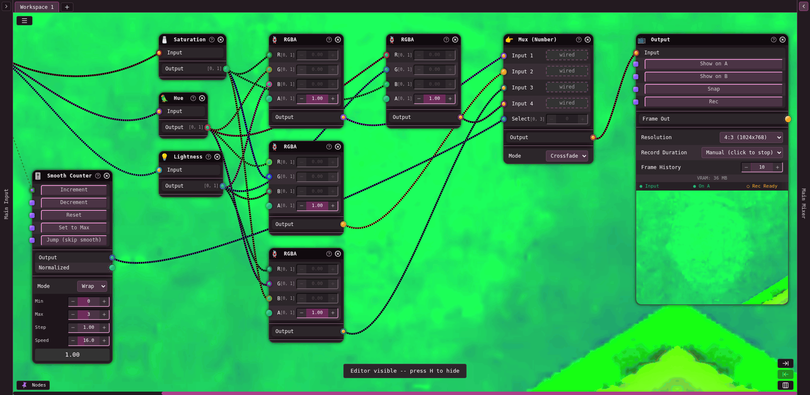

*Both panels collapsed. The output is projected to the background, so the patch floats on the
live show.*

### Main Mixer — the right panel

Also collapsible. **Channel A** and **Channel B**, each showing a live thumbnail of whichever
Output claimed it and the name of the workspace it lives on, or `No Assignment`. Then:

- **A / B Balance**, an `s-number` from −1 to +1, curved through
  `0.5 + 0.5·tan(mix·π/2)` so the ends are hard A and hard B.
- **Crossfade Method**, eight of them: simple mix, horizontal wipe, vertical wipe, radial
  wipe, dark-first luminance, light-first luminance, checkerboard, horizontal lines.
- **Projection**: a resolution select, a **Project to Background** checkbox — which paints
  the mixed result behind the editor, nodes and cables floating on the live show — and
  **Open Projector**, a second window fed by `canvas.captureStream()`.

One mixed texture, three consumers: the two channel previews, the editor background, and the
projector window.

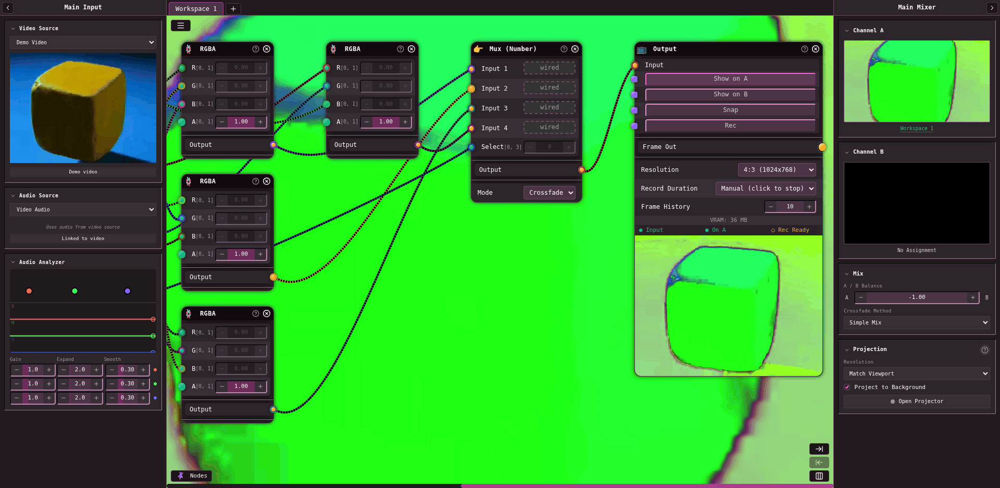

*One click on **Show on A** claims the mixer channel, fills the channel preview with a live
thumbnail labeled with its workspace, sets the Output's status line to `● On A`, and paints
the result behind the editor.*

### The app menu, and modals

A hamburger, top-left of the editor: **Save As… · Open… · Save Quickload · Theme · MIDI ·
About · How To**.

- **Save** — a thumbnail chosen from any Output node (arrows cycle them), plus Name, Author
  and Description. Patches carry their own metadata.
- **Open** — Examples / Local Storage tabs, a card per patch with thumbnail, author and
  description, and three buttons: *Open*, *Add In* (merge into the current workspace), and
  download. Plus `+ Upload .svs`.
- **Theme** — four swatches (Main UI, Number Ports, Color Ports, Event Ports), fifteen named
  presets, and the six wire settings plus a glow-amount number and reverse-scroll.
- **MIDI** — devices with a Refresh, a mappings table with live values and per-row unmap and
  Clear All, and a Monitor toggle for incoming messages.
- **How To** — a real manual, with a table of contents, scroll-spy, a Win/Linux ↔ macOS key
  toggle, and screenshots.

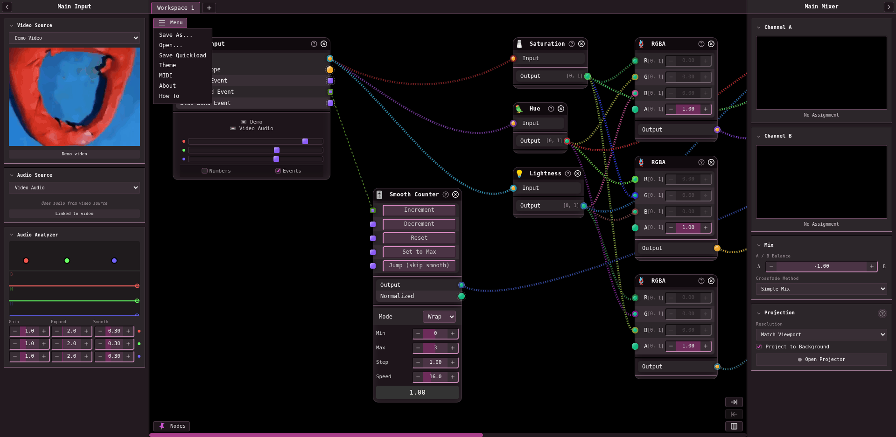
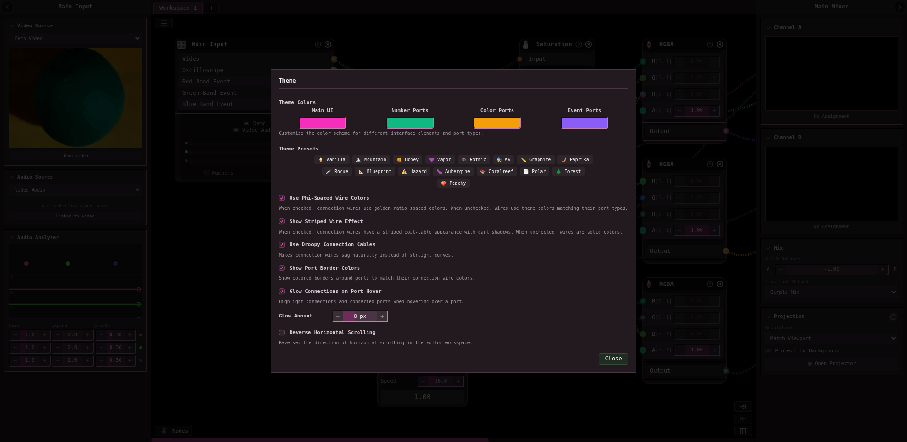

*Left, the hamburger menu. Right, Theme — the four anchors are exactly `theme.rs`'s, and
here they are typeable.*

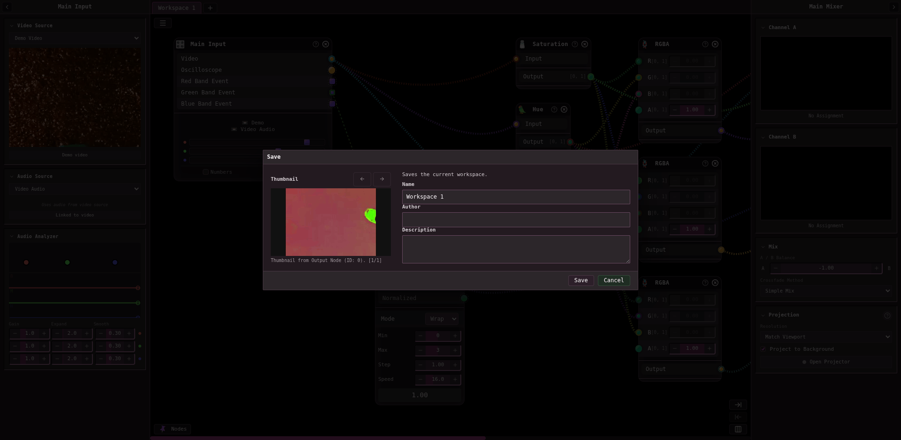
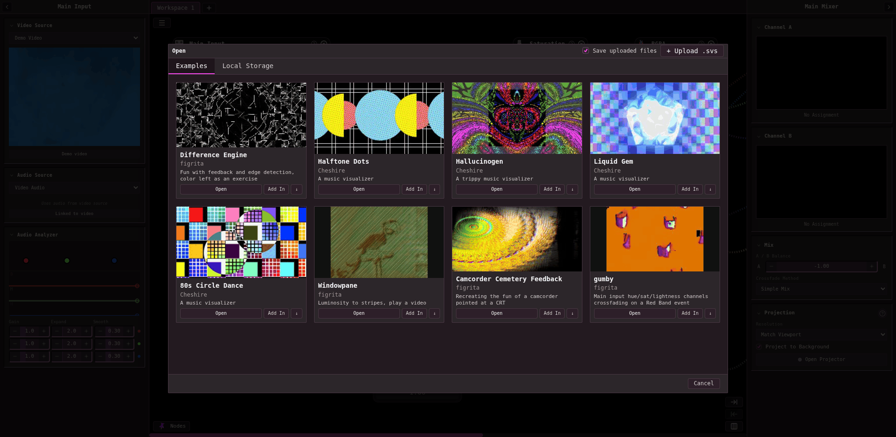

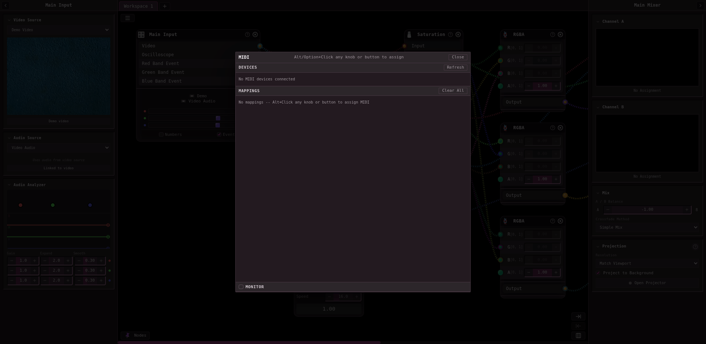
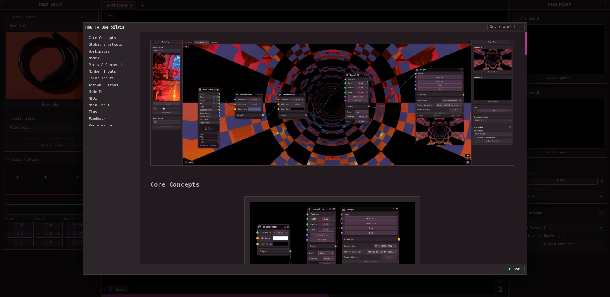

### Workspaces

A tab bar. `+` adds; double-click renames; right-click gives Rename · Properties… · Close. A
node has a *set* of workspaces it appears on, and a cable spanning two of them tags both
ports so you can see the off-screen connection.

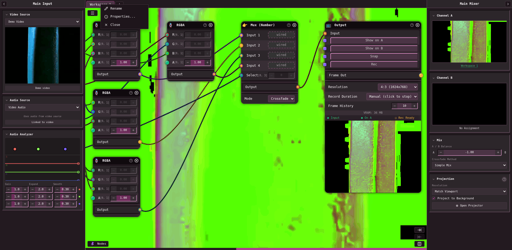

### Corner controls

Bottom-right: **Extend** and **Crop** workspace width, and **Layout** (auto-arrange).

---

## Part 1b — The library, audited

156 registered node types, dumped from the live registry rather than read off the files —
`entry.create()` returns the whole definition, so ports, controls, ranges and option choices
are the real ones. The dump is [affordances/registry.json](affordances/registry.json): every
node's ports with their types, every control with its default, range, step and unit, and
every option with its choices. That file is the input to F6, and it is what makes porting a
node a transcription rather than a reading exercise. What follows is what is *structurally*
interesting in it.

### The audio bundle: one shape, four nodes

Every audio-capable source publishes **the same eight ports**, and this is the single most
copyable idea in the library:

| port | type | |
| --- | --- | --- |
| `bass` `mid` `high` | float | band levels, gain/expand/smooth per band |
| `oscilloscope` | **color** | the waveform, as a picture |
| `bassThreshold` `midThreshold` `highThreshold` | **action** | fires when that band crosses its threshold |

`video`, `maininput`, `audioanalyzer` and `micline` all publish it; `micline` adds `volume`
and `volumeThreshold`. So a video file, the global input, an audio file and the microphone
are **interchangeable** at the port level — repatch the source and the whole downstream
show still works. That is worth far more than any individual node.

Three mechanisms inside it are each worth taking on their own:

**1. The threshold slider *is* the action port.** It is a 12 px rounded square — the action
port shape — painted in `--port-action-bg`, dragged along the meter bar, and it flashes when
it fires. The control that sets the level and the port that emits the event are the same
object, sitting on top of the data it measures. There is nothing to explain.

**2. An action is a gate, not a pulse.** Crossing up calls the destination's `downCallback`
after a `debounceMs` hold-off; falling back below calls `upCallback`. That is why an ADSR
envelope works, and why MIDI Note On/Off maps onto the same thing. **A bare pulse would not
be enough** — this is the detail to get right before writing any action node.

**3. The waveform reaches the shader as a 512×1 `R8` texture**, re-uploaded per frame with
`texSubImage2D`, and the `oscilloscope` output is eleven lines of GLSL that samples it and
draws a line. The general primitive is *a CPU array becomes a 1-D lookup texture a color
output samples* — and it would serve palettes, automation curves, sequencer lanes and LFO
tables just as well as a waveform.

### The video node is not just a picture

`video` carries `play`, `pause`, `stop` and **`randomizeTime`** as action inputs, a
`playbackRate`, and the entire audio bundle above — a video file analyzes its own soundtrack.
`imagegif` handles stills and animated GIFs through one node. `webcam` has a Mirror option;
`screencapture` is a node.

### Six patterns worth stealing

**1. A generator publishes its own field.** Twenty-one nodes emit a `mask` float alongside
the color: every generator (`circle`, `star`, `polygon`, `spiral`, `grid`, `polkadot`),
every noise (`perlin`, `simplex`, `worley`, `fractal`, `static`, `randomhurl`), every fractal
(`mandelbrot`, `juliaset`, `lyapunov`), both Regions, `repeater`, `drawingcanvas` and
`brickgame`. **The shape a node drew is available as a number without redrawing it** — so
masking, displacing, thresholding and compositing are all one cable rather than a duplicated
subgraph. supersilvia's `checkerboard` publishes color only, and every generator ported from
here should publish both.

**2. The crossfader is a node as well as a panel.** `mixer` has Deck A, Deck B, a fade from
−1 to +1, and **the same eight crossfade methods** as the Main Mixer. Build the node first
and the global mixer is that node with its inputs bound to the two channels — one shader, one
list of methods, no second implementation to drift.

**3. A palette is one parameter.** `palette` takes one color and publishes **eight**
harmonious variations in OKLCH, with spread, shift, curve and per-axis L/C spread — all of
them float inputs, so the whole scheme can be driven from an oscillator or the bass band.
`cosinegradient` is the Iñigo Quílez form, `bias + amp·cos(2π(freq·t + phase))` with
per-channel control: a float becomes a color ramp in one node. This is exactly the
*"one parameter, everything else derived"* discipline `docs/design-system.md` already argues
for, aimed at the picture instead of the chrome.

**4. Range plumbing deserves nodes.** `reframerange` maps `in[min,max] → out[min,max]` with
an optional clamp, and every one of those four bounds is itself an input. `sliderule` does
the same with basis and invert per side. Without these, remapping is three math nodes and a
lie about what the patch is doing.

**5. Ship opinionated macro nodes.** `camcordercrt` is barrel distortion, chromatic
aberration, scanlines, phosphor glow, brightness, vignette **and** a spatial feedback loop
with zoom, rotation, drift and tilt — one node, ten inputs, one recognizable look. The atoms
exist separately; the combination is what someone actually reaches for at a gig.

**6. Debug by drawing on the picture.** The `debug` node takes a float and a color, renders
the number as text into the image at a position you choose, and passes the picture through.
`note` is a comment box on the canvas. The first is ported; the second is not a GLSL node and
was built separately.

### The individually notable

| node | why |
| --- | --- |
| `xypad` | an instrument, not a control: physics, drag, spring, edge modes (bounce/wrap/clamp/unbound), right-drag to place **gravity wells or tethers**, and it publishes `x`, `y`, `speed` **and** a `bounced` action |
| `gamepad` | sticks and triggers as floats, buttons and d-pad as **actions**. A controller is a patchable device |
| `mouseinput` | the cursor over the editor as two floats. Nearly free here |
| `stepsequencer`, `euclideanrhythm` | four **action lanes** each, with bpm and gate length. Euclidean takes beats and rotation per lane |
| `bpmclock` | tap tempo, seven subdivisions, adjustable gate length, one action out |
| `clockdivider` | divides an action stream. The composability test for the event system: it takes actions and emits actions |
| `adsrenvelope` | gate in, float out, per-stage curve choice. Needs the down/up gate to exist |
| `automation` | records a float over time and plays it back, looped or once, with trim. Automation without a timeline |
| `animation` | start/end over a duration, with separate **approach and return** curves — and `Jump` and `Stay` as return modes |
| `counter` / `smoothcounter` | increment/decrement/reset/set as actions, clamp or wrap, publishing both raw and **normalized**. The smooth one adds a speed and a `jump` that skips it |
| `muxevent` / `muxnumber` | four color inputs switched by next/prev/random actions, or by a number, with a **crossfade** mode |
| `layerblend` | nine Photoshop blend modes with an opacity |
| `channelsplitter` | color to four floats in one node, against four `decompose` nodes here |
| `supersampling` | anti-aliasing as a node: 1x, 2x2, 3x3, 4x4 |
| `regionabsolute` / `regionsized` | crop with edge softness, and outside handled as background color, tile, mirror tile or clamp — plus the mask |
| `glitch` | **syncs to BPM with subdivisions and also takes a trigger action.** A node can be clocked and played at once |
| `pixelsort` | hash-randomized chunk boundaries, sort by brightness or hue, a `reseed` action |
| `brickgame`, `cellularautomata`, `slimemold` | simulations that are proper citizens: color out, `mask`, floats (`score`, `density`), and action outputs (`brickBroken`, `ballLost`, `gameWon`) |
| `text`, `drawingcanvas` | a canvas rendered to a texture. `drawingcanvas` has tools, symmetry modes, wrap modes, a `mask` and a `strokeDone` action |
| `prideflag` | ten flags, one option. Says what the project is |

### One thing silvia gets wrong that we already avoid

Exactly **one** control in 156 nodes is marked `logScale` — `zoom`. Meanwhile `frequency`,
`flowScale` and every other decade-spanning parameter scrub linearly. supersilvia's
`NumberSpec::log` is per-control and already used more sensibly; do not import the habit.

---

## Part 2 — Where supersilvia stands

**Has, and in several places better.** The event half — an action is a gate, an event carries
when it happened, and `button`, `bpmclock`, `clockdivider`, `counter` and `adsr` inhabit it;
the number control with silvia's gestures — `↑`/`↓`, `Escape` mid-drag, a drag on the track
and `Ctrl` on a stepper among them — the range editor on a right-click rather than `Ctrl` +
hover, and a range that cannot escape the definition's; a color control with a picker of its
own — a saturation/value square with a hue bar and an alpha bar, where silvia has four HSLA
sliders — and silvia's hex field under it; MIDI keyed by channel and number, `Alt` + click to
learn on a number control, an action button or the fade, a dot on whatever is bound, and a
window of its own; the three node menus over one list, with the same fuzzy scoring; one
selection menu with Copy, Cut, Paste, Duplicate, Collapse, Reset controls, Disconnect all,
Workspaces, Move to and Delete; workspaces as views, with tabs and the cross-workspace tag;
the project folder with a picture per workspace, import as the merge, assets copied in and a
poster on every clip's card; the preferences store; the audio bundle with the oscilloscope,
the band handles and the monitor; the plane/strip layout modes with a minimap; auto-arrange as
an undoable command carrying its own height; undo by snapshot; zero-flash; the Main Mixer, all
of it, as a render target of its own, with Project to background, `H`, `F`, and the mix in a
picture window, which is what silvia's projector was; `Snap` and a Render section on the
Output; the `UniformNumber` port and the CPU clock; taps; DMA-BUF import; the accessibility
tree as the agent's API; double-click-to-delete a cable; the Nodes menu generated from
`REGISTRY`; illegal connections unofferable; a disabled control under a connected input.

**Partial.**

| | silvia | supersilvia |
| --- | --- | --- |
| node context menu | Collapse, Delete Connections, Duplicate, Reset Controls, Clear MIDI, Delete, workspaces | Copy, Cut, Paste, Duplicate, Collapse, Reset controls, Disconnect all, Workspaces, Move to, Delete. No Clear MIDI |
| Output node | show-A/B, snap, rec, frame history, VRAM, status | `Show on A`, `Show on B` and `Snap` as action inputs that are buttons, `Frame Out`, a resolution with its memory figure, a Render section in place of Rec, the status line. No frame history: it went with [history-delay.md](history-delay.md), declined |
| theme | four anchors **editable**, 15 presets, wire settings | the four anchors as `s-color` swatches under `Edit ▸ Preferences…`, silvia's presets, and hover lighting, phi-spaced colors and droop for cables. No coil stripes, no glow |
| save/load | metadata, thumbnails, examples browser, merge | the project folder, a picture per workspace, import as merge; no author or description, no examples |
| Main Input | a global source panel, `maininput` nodes read it | the same, plus screen capture through the portal, Syphon, NDI and a loopback; no demo video, and the analyzer is this app's scope rather than nine shaping knobs |

**Missing entirely.** A project's name, author and description · an examples browser.

**Library.** 164 node types against 156, and none of silvia's is left without an answer.
Most are ported, under silvia's name or a plainer one. The rest are decisions: `feedback` and
`feedbackmix` are a cable from an Output's `Frame Out`
([docs/decisions.md](../docs/decisions.md#feedback-is-a-cable-not-a-node)), `offlineoutput` is
the Output's Render section, `colordither` is a Pattern and a Scale on Posterize, `debug` left
because a port's row and `tap` already read a number out, and `variabletimefeedback` went with
[history-delay.md](history-delay.md). Node by node, what differs from silvia's is
[silvia-node-parity.md](silvia-node-parity.md).

---

## Part 3 — What is left

The four fundamentals are built, and their behavior lives in `docs/`. Each keeps a heading
here because the numbering is the original plan's, so that `docs/decisions.md` can keep naming
F4. What is left of the gap is Part 2's table and the open questions below.

### F4 — The mixer is one more render target

**Built.** The Main Mixer is a render target and not a node: two decks claimed by an Output's
`Show on A` and `Show on B`, the fade and silvia's eight crossfades in the one program that
never recompiles, and a claim that allocates nothing. Its picture goes to the panel, behind
the canvas, and to a window of its own; `H` shows it alone and `F` fills the screen. See
[docs/rendering.md](../docs/rendering.md#the-mixer),
[docs/ui.md](../docs/ui.md#the-main-mixer-panel) and
[docs/decisions.md](../docs/decisions.md#the-mixer-is-a-render-target-with-two-decks-not-a-node).

### F5 — The theme editor

**Built.** `Edit ▸ Preferences…`: the four anchors as `s-color` swatches, silvia's sixteen
presets, and the cable and scrolling toggles beside them. See
[docs/ui.md](../docs/ui.md#the-preferences-window).

### F6 — The stateful library

**Built.** The nodes with an `onCreate`, a `runtimeState` or a `values` bag — `xypad`,
`stepsequencer` and `euclideanrhythm`, `automation` and `animation`, `text` and
`drawingcanvas`, `note`, the games and the simulations — are in the registry. See
[docs/nodes.md](../docs/nodes.md#the-library).

**Do not import `categories.js`.** `NodeDef::category` already carries the grouping and is
the reason the registry stays the single source; keep it that way.

### ~~F7 — MIDI, on the addresses that exist~~

Built. `midi/`, the map in `project.ssp`, `Alt` + click to learn, and a window of its own:
[docs/media.md](../docs/media.md#midi), [docs/ui.md](../docs/ui.md#the-midi-window).

Three things this section got wrong. There is no `ControlRef` — `PortRef` already addresses
a control *and* an action input, because a number control is keyed by the input port it
belongs to. The map is keyed by **channel and number**, which silvia's own is not. And a
binding names no device at all: which box is on the table is the rig, so every source is
wired in at once.

And it was right that **a mapped control wears a dot**, which it now does — named, so the
accessibility tree carries what drives it.

## Order, and what each step buys

| | fundamental | buys |
| --- | --- | --- |
| 1 | ~~F4 mixer as a render target~~ | A/B, eight crossfades, background projection, the mix in a window, and the thing `H` shows — built |
| 2 | ~~F6 the stateful library~~ | the instruments and the simulations — built |
| 3 | ~~F5 the theme editor~~ | four anchors become a product feature — built |
| 4 | ~~F7 MIDI~~ | hands on the controls — built |

## Open questions

- **Is an examples browser over a folder of projects worth a page?** silvia's open modal
  shows its examples on cards. A project is its folder name, with no name, author or
  description of its own, so a card here would carry the folder name and a picture.

## Explicitly not here

Timelines, the solids workspace kind, and rendering to a file each have a proposal. This one
deliberately stops at the things a single workspace in a single window can do, because every
one of them is needed whatever those proposals decide.

## A note on method

silvia was driven headlessly for this: Chromium over the DevTools Protocol against
`python -m http.server`, clicking and screenshotting every menu, panel and control. The
screenshots in [affordances/](affordances/) are those frames, palette-quantized to 256
colors — lossless for chrome and text, and a third of the bytes.

**Part 1b is not read off the source.** Node definitions are spread across 144 files, several
of which register more than one type, and the interesting fields — control ranges, option
choices, port types — are assembled at registration. So the registry was dumped from the
running app instead: `import('/js/registry.js')`, then `entry.create()` per slug, which
returns the whole definition object. 156 types, no guesses, and it takes about a minute to
redo when silvia moves.

The supersilvia half is from source and from `docs/` — the app builds and runs and holds port
5719, but its window was not painting when the inspection server was asked for a frame, so
nothing here rests on a screenshot of it.
